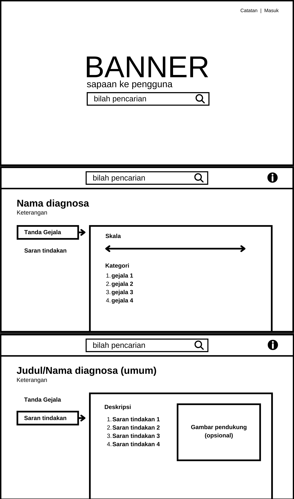
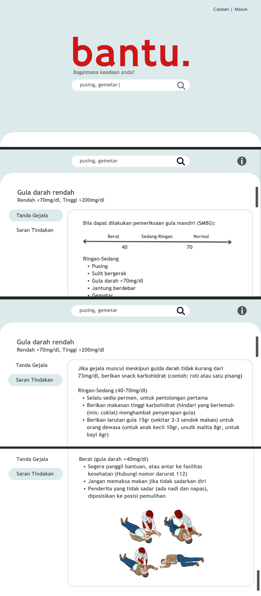

# Bantu
Bantu (Bantu Analisis Non-obat dan Tindakan untuk Umum), secara umum adalah aplikasi pencarian basis data sederhana. Repo ini dibuat untuk demonstrasi konsep **Bantu** sebagai aplikasi yang membantu mengetahui tindakan-tindakan yang bisa dilakukan di rumah (saat ini hanya untuk konteks diabetes).

## Konsep Bantu
Konsep:  

  
     

Konsep antarmuka (branch tampilan):  

  
   

---

## Jika Ingin Memakai Sendiri
1. Clone repo ini:
   
   ```bash
   git clone https://github.com/cicag/bantu
   ```
2. Pindahkan folder ke dokumen root webserver
3. Import database (bisa pakai phpmyadmin) atau:
   
   ```bash
   ./mysql -u root -p bantu < db.sql
   ```
4. Jalankan webserver dan akses dari localhost
---
## Note
Default database:  

```
address  : localhost
username  : root
password  : 1234
database  : bantu
```
Bisa disesuaikan di functions.php
